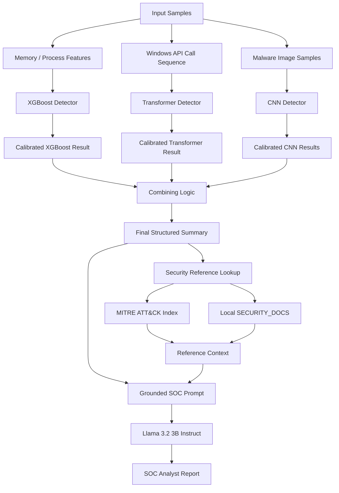
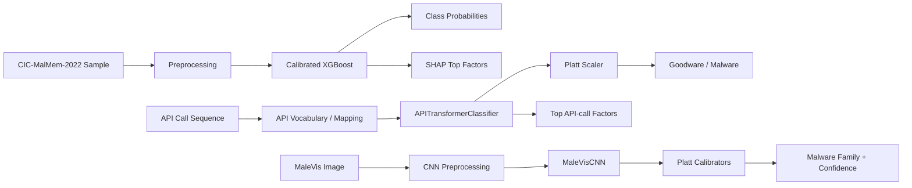
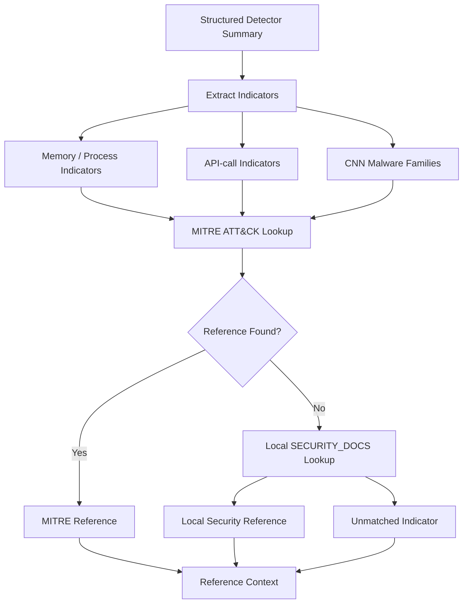
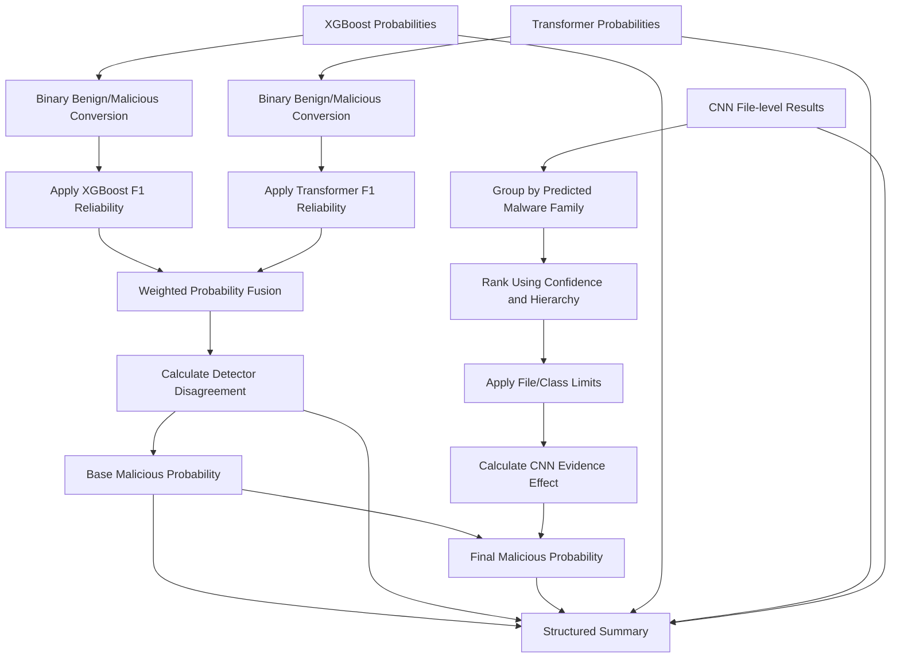
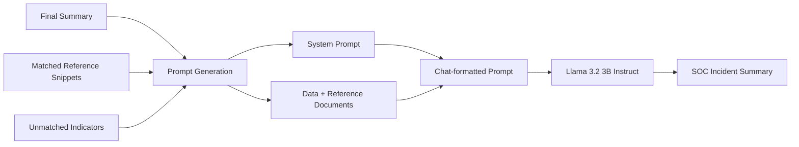
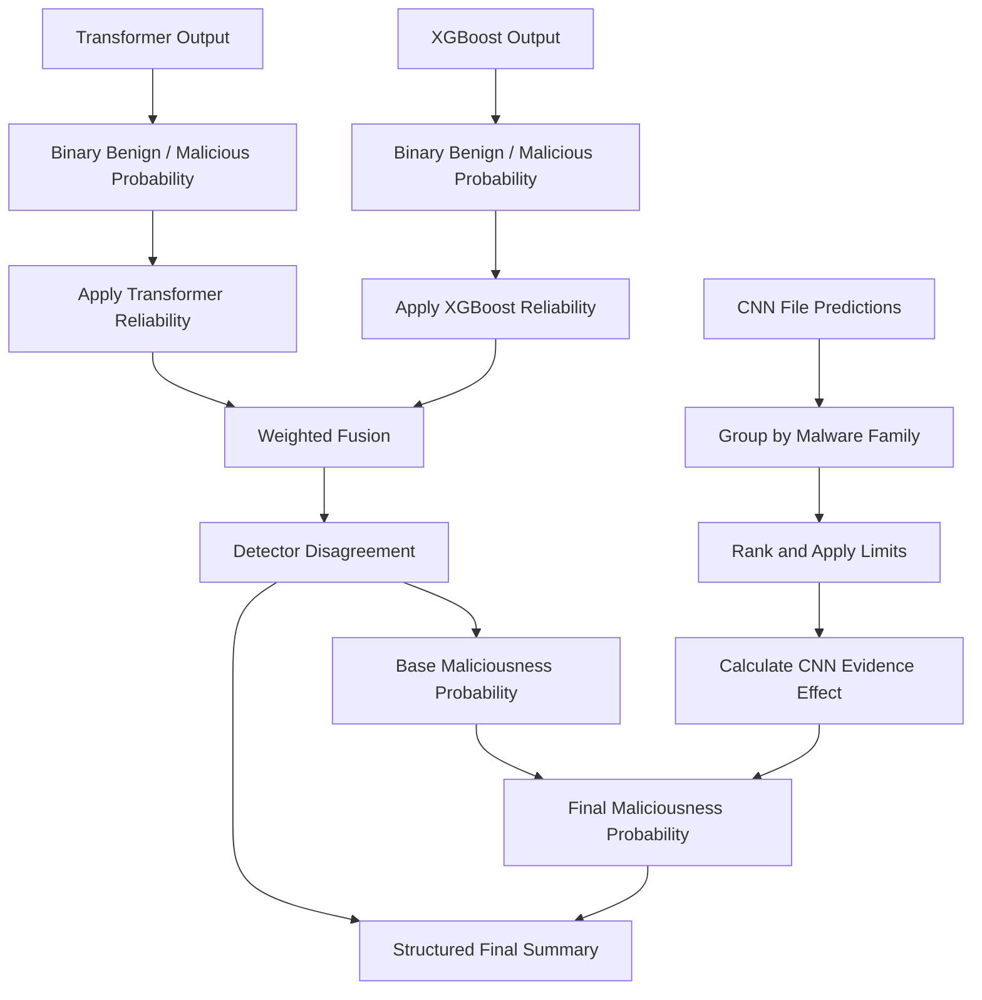
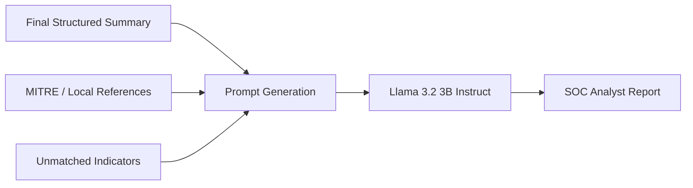

# SOC Analyst Assistant

## Overview

SOC Analyst Assistant is a multi-model malware analysis pipeline that combines three independent detectors with security-reference grounding and LLM-based SOC report generation.

The system treats different malware representations as **independent evidence channels**:

- **Memory/process evidence:** XGBoost analyzes memory/process features from the CIC-MalMem-2022 dataset and classifies them into Benign, Ransomware, Spyware, or Trojan.
- **Behavioral evidence:** A Transformer analyzes Windows API-call sequences and classifies them as Goodware/Benign or Malware.
- **File evidence:** A CNN analyzes MaleVis image representations and predicts malware families from suspicious file samples.

These detectors are trained independently because there is no single unified dataset providing all three representations for the same malicious activity. The system instead models them as complementary, sensor-like evidence sources that can provide different views of a security investigation.

The calibrated detector outputs are combined into a final maliciousness probability. The resulting structured evidence is then enriched with MITRE ATT&CK and local security-document references before being passed to a Llama 3.2 3B Instruct model to generate a SOC-style incident report.

The main execution flow is implemented in `main.ipynb`, while reusable inference, fusion, security-reference, prompt-generation, and summary-building logic is separated into the `utilities` directory.

## Key Features

| Feature | Implementation |
| --- | --- |
| Multi-channel malware detection | Combines three independent detectors operating on memory/process, behavioral, and file representations. |
| Memory/process analysis | XGBoost processes CIC-MalMem-2022 features and produces multiclass malware-state predictions. |
| API-call behavior analysis | Transformer processes Windows API-call sequences and predicts Goodware/Benign or Malware. |
| Malware-family classification | CNN processes MaleVis image samples and predicts available malware-family classes. |
| Probability calibration | Detector outputs are calibrated using stored calibration artifacts, including Platt scaling. |
| XGBoost evidence extraction | SHAP values identify the features contributing most strongly to an XGBoost prediction. |
| Behavioral evidence extraction | Important API-call factors are retained from Transformer inference for downstream reporting. |
| Evidence fusion | Calibrated XGBoost and Transformer probabilities are combined using reliability-weighted fusion and detector disagreement. |
| CNN evidence aggregation | File-level CNN predictions are ranked, grouped by malware family, and limited before contributing to the final maliciousness estimate. |
| Structured evidence summary | Detector outputs and fusion results are converted into a common `final_summary` structure. |
| MITRE ATT&CK grounding | MITRE ATT&CK STIX data is indexed for technique and software lookups during report generation. |
| Local security-document fallback | Indicators that cannot be resolved through MITRE ATT&CK can be matched against the local `SECURITY_DOCS` reference data. |
| Grounded SOC reporting | The LLM receives structured detector evidence together with matched security references and explicitly tracks unmatched indicators. |
| Reusable inference utilities | Model inference, fusion, reference lookup, summary generation, and prompting are separated into reusable modules. |

## Architecture

The system is organized around four stages:

1. **Independent detector inference** over different evidence channels.
2. **Calibration and evidence fusion** to produce an overall maliciousness estimate.
3. **Security-reference grounding** using MITRE ATT&CK and local security documentation.
4. **LLM-based SOC report generation** using the structured evidence and retrieved references.



### Detector Layer

Each detector is implemented as an independent calibrated inference pipeline.



The detector implementations reconstruct the required model architectures, load the stored weights and preprocessing artifacts, run inference, and return calibrated results for downstream processing.

### Independent Evidence Channels

The three detectors are intentionally independent. Each observes a different representation of potentially malicious activity.

This architecture is intended to represent how a security investigation can contain heterogeneous evidence. For example, memory/process state can provide one view of an event, API-call behavior can provide another, and suspicious files can provide artifact-level evidence.

The datasets are therefore **not treated as a single multimodal training dataset**. Instead, each dataset is used to train a detector specialized for its own evidence channel.

## Security Reference Grounding

---

The fusion result provides a structured security assessment, but the SOC report also needs contextual information about the detected indicators.

The project therefore uses two security-reference sources:

### MITRE ATT&CK

MITRE ATT&CK STIX data is loaded and indexed for efficient lookups.

The system maintains indexes for relevant ATT&CK entities such as:

- Techniques
- Software
- Groups

When detector evidence produces an indicator that can be mapped to an ATT&CK entry, the corresponding technique or software information is retrieved and added to the report context.

The indexing step avoids repeatedly scanning the complete STIX bundle for every indicator.

### Local Security Documentation

MITRE ATT&CK does not necessarily contain a suitable reference for every indicator produced by the detectors.

When an indicator cannot be resolved through the MITRE indexes, the system falls back to the local `SECURITY_DOCS` reference data.



The system also preserves indicators for which no suitable reference is found. This prevents the reporting stage from silently presenting an unsupported external attribution as established fact.


## Fusion and Evidence Processing

The fusion stage does not treat every detector output identically.

The XGBoost and Transformer outputs are first reduced to binary benign/malicious probabilities. Their class probabilities are adjusted using fixed per-class F1 reliability scores, after which the two detectors are combined. The implementation also calculates detector disagreement and uses it when blending the probability estimates.

CNN results are processed separately. Predictions are grouped by malware family, ordered according to the configured hierarchy, and limited by the configured maximum number of files and per-class selections. The selected CNN evidence is converted into a bounded adjustment to the XGBoost + Transformer base maliciousness probability.




## SOC Report Generation

`json_summary_generator.py` creates the structured payload passed to the reporting stage. It contains the base maliciousness probability, disagreement score, final maliciousness probability, detector predictions and confidence values, supporting XGBoost features, Transformer API-call evidence, and selected CNN file results.

`prompt_generation.py` then combines this structured data with the retrieved reference documents. The prompt explicitly instructs the LLM to use the supplied reference documents as the source of truth for explaining indicators and to identify indicators for which no reference is available.

The generated report is structured into:

* `VERDICT`
* `FINDINGS BY DETECTOR`
* `ATTACK CONTEXT`
* `CONFIDENCE & DISAGREEMENT`
* `RECOMMENDED NEXT STEPS`



## Main Components

| Component                   | Responsibility                                                                                                                                  |
| --------------------------- | ----------------------------------------------------------------------------------------------------------------------------------------------- |
| `main.ipynb`                | Orchestrates data loading, model initialization, inference, fusion, summary generation, and SOC report generation.                              |
| `inference_functions.py`    | Contains the XGBoost, Transformer, and CNN calibrated inference pipelines and model definitions required to reconstruct the trained models.     |
| `combining_logic.py`        | Combines detector probabilities and aggregates CNN evidence into the final maliciousness probability.                                           |
| `fixed_config.py`           | Stores fixed model reliability scores, malware-family hierarchy, API-call vocabulary, and inference limits derived from the training notebooks. |
| `json_summary_generator.py` | Converts detector and fusion results into the structured summary consumed by the reporting stage.                                               |
| `security_docs.py`          | Loads, indexes, and queries MITRE ATT&CK and local security references.                                                                         |
| `prompt_generation.py`      | Builds the grounded SOC prompt and invokes the Llama model to generate the incident report.                                                     |
| `training/`                 | Contains the notebooks used to train the three detector models.                                                                                 |
| `artifacts_*`               | Contains trained model weights, preprocessing pipelines, calibration artifacts, metrics, and supporting configuration for each detector.        |

## Current Scope

The repository currently demonstrates the complete path from selected malware-analysis samples through multi-model inference, probability fusion, security-reference lookup, and LLM-generated SOC reporting.

The main notebook uses predefined dataset paths and sample indices rather than exposing a standalone application interface. The reusable inference logic is separated into utility modules, but the overall orchestration remains notebook-based.


## Detector Layer

### XGBoost — Memory / Process Evidence

The XGBoost detector operates on CIC-MalMem-2022 memory/process features and predicts one of the available malware-state classes:

- Benign
- Ransomware
- Spyware
- Trojan

SHAP values are additionally extracted to identify the features contributing most strongly to the prediction. These features become part of the structured evidence supplied to later stages.

### Transformer — Behavioral Evidence

The Transformer processes sequences of Windows API calls. Instead of examining a static feature vector, it models the sequence of observed API behavior and predicts:

- Goodware / Benign
- Malware

Important API-call factors are retained so that the behavioral detector can contribute interpretable evidence to the final report.

### CNN — File Evidence

The CNN processes MaleVis image representations of suspicious files and predicts malware families.

Because multiple files may be available during an investigation, CNN predictions are aggregated rather than treated as a single binary detector output. Predictions are grouped by malware family, ranked using the configured hierarchy and confidence, and limited using the configured file/class limits.

## Calibration and Evidence Fusion

The detector outputs are not directly combined as raw probabilities.

Each detector has its own confidence characteristics, so stored calibration artifacts are applied during inference before downstream fusion.

The XGBoost and Transformer outputs are converted into binary benign/malicious probabilities and adjusted using fixed reliability scores derived from their evaluation performance. These calibrated probabilities are then combined while also measuring disagreement between the two detectors.



The CNN is handled separately because its output represents **file-level malware-family evidence** rather than the same binary maliciousness signal produced by the XGBoost and Transformer detectors.

The selected CNN evidence therefore contributes a bounded adjustment to the base maliciousness probability rather than being treated as a third identical probability source.

The final summary retains:

- calibrated detector probabilities;
- detector predictions and confidence values;
- detector disagreement;
- final maliciousness probability;
- XGBoost SHAP factors;
- important Transformer API-call factors;
- selected CNN file predictions and malware families.


## Design Decisions

### 1. Independent Evidence Channels

A single unified dataset containing memory state, API-call behavior, and malware-file representations was not available. Rather than forcing unrelated datasets into a common training setup, the system treats them as **independent evidence channels**.

Each detector therefore specializes in its own scope:

- XGBoost → memory/process evidence
- Transformer → behavioral/API evidence
- CNN → suspicious file evidence

The goal is not to claim that samples from the three datasets represent the same attack. Instead, the architecture demonstrates how heterogeneous security evidence can be analyzed independently and combined at the assessment stage.

### 2. Probability Calibration

The three detectors have different architectures, datasets, and confidence distributions. Raw model probabilities are therefore not assumed to be directly comparable.

Calibration artifacts are applied during inference before probability-based fusion. This provides a more consistent confidence signal for downstream evidence aggregation.

### 3. Reliability-Weighted Fusion

The XGBoost and Transformer detectors are not given equal influence by default.

Their outputs are weighted using fixed reliability values derived from their evaluation performance. Detector disagreement is also explicitly calculated because strong disagreement between independent evidence channels is itself useful information for a SOC analyst.

The objective is therefore not simply:

```text
average(model_1, model_2, model_3)
```

but rather:

```text
calibrated evidence
        +
detector reliability
        +
detector disagreement
        ↓
overall maliciousness estimate
```

### 4. Separate CNN Evidence Aggregation

CNN predictions represent individual suspicious files and malware families rather than the same binary classification task as the XGBoost and Transformer models.

Therefore, CNN evidence is grouped, ranked, and limited before producing a bounded adjustment to the base maliciousness probability. This prevents a large number of similar file predictions from overwhelming the other evidence channels.

### 5. LLM as an Interpretation Layer

The LLM is not intended to replace the underlying detectors or independently establish the evidence base.

Instead, it receives:

- the structured detector results;
- the final maliciousness assessment;
- detector disagreement;
- extracted evidence;
- matched security references;
- unmatched indicators.

The LLM uses this information to generate a SOC-style interpretation and recommended next steps.

This separation keeps the model responsible primarily for **interpreting and communicating structured evidence**, rather than making the entire security assessment depend on unconstrained LLM reasoning.

## SOC Report Generation

`json_summary_generator.py` converts the detector and fusion results into the structured payload consumed by the reporting stage.

`prompt_generation.py` then combines this structured evidence with the retrieved security references and generates a grounded prompt for Llama 3.2 3B Instruct.

The report is organized into:

- `VERDICT`
- `FINDINGS BY DETECTOR`
- `ATTACK CONTEXT`
- `CONFIDENCE & DISAGREEMENT`
- `RECOMMENDED NEXT STEPS`

The reporting pipeline is:



The prompt instructs the LLM to use the supplied security references when explaining indicators and to distinguish indicators for which no supporting reference is available.

## Sample Output

A typical generated report follows the structure below:

```text
VERDICT
-------
Overall maliciousness: 87.4%

The combined detector evidence indicates a high likelihood of malicious
activity. The behavioral detector and memory/process detector provide
consistent malicious signals, while the file evidence identifies
malware-family characteristics consistent with the observed activity.

FINDINGS BY DETECTOR
--------------------
Memory / Process:
- Prediction: Ransomware
- High-confidence contributing memory/process features identified by SHAP.

Behavior:
- Prediction: Malware
- Suspicious API-call patterns were identified in the observed sequence.

File Evidence:
- Multiple files were classified into malware-family categories.
- The highest-confidence file predictions contributed to the final assessment.

ATTACK CONTEXT
--------------
The detected indicators were matched against the supplied MITRE ATT&CK
and local security references where available.

CONFIDENCE & DISAGREEMENT
-------------------------
Detector disagreement: Moderate

The detectors do not provide identical confidence estimates. The final
assessment therefore incorporates both detector reliability and disagreement
rather than relying on a single model prediction.

RECOMMENDED NEXT STEPS
----------------------
- Investigate the processes associated with the identified memory indicators.
- Review the observed API-call activity and associated processes.
- Isolate and further analyze suspicious files.
- Correlate the identified indicators with additional endpoint telemetry.
```

*The above is an illustrative example of the report structure rather than a fixed output.*

## Current Scope

The repository demonstrates the complete path from heterogeneous malware-analysis evidence through independent model inference, probability calibration, evidence fusion, security-reference lookup, and LLM-generated SOC reporting.

The current implementation is notebook-oriented, with `main.ipynb` orchestrating the complete workflow while reusable inference, fusion, security-reference, summary, and prompt-generation logic is separated into utility modules.

The system currently demonstrates the **analysis and reporting pipeline**, rather than a production SOC interface or real-time endpoint monitoring system.

