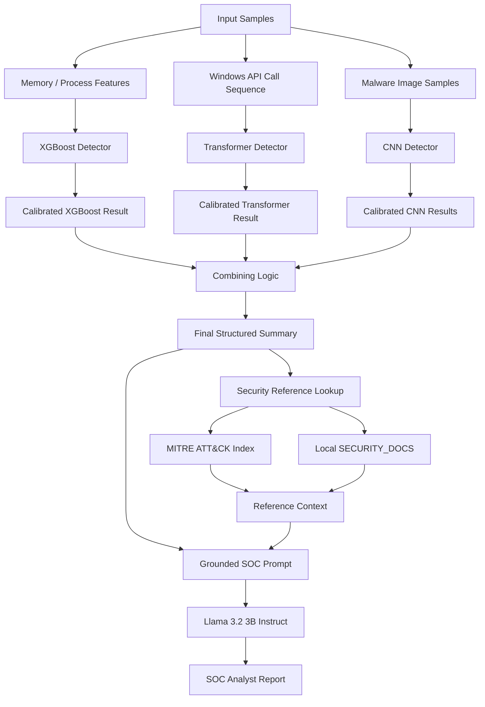
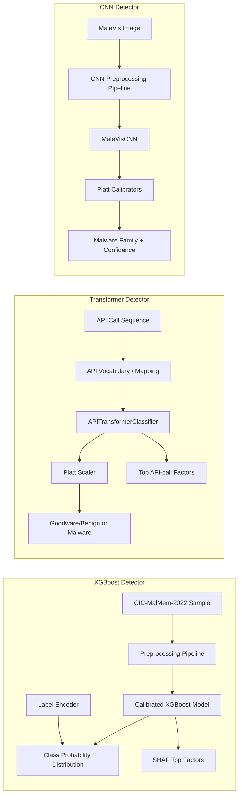
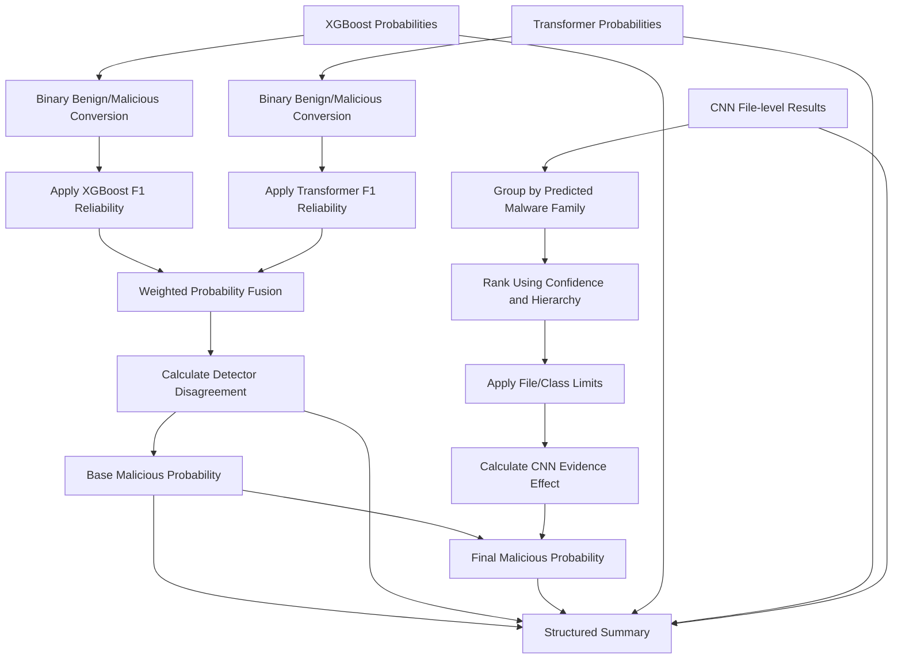
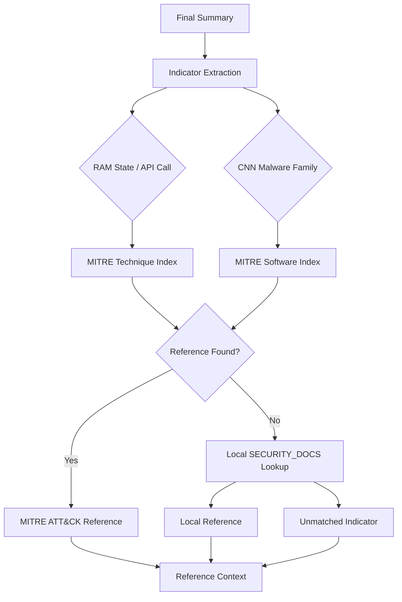
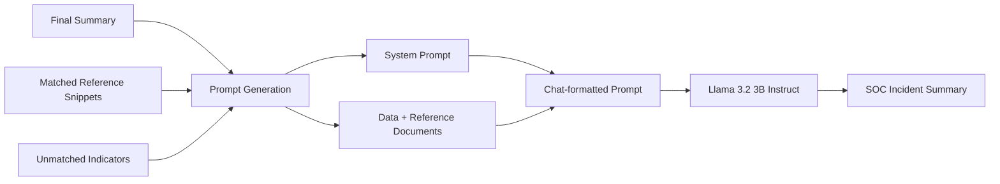

<h1 align="center">SOC Analyst Assistant</h1>

## Overview

SOC Analyst Assistant is a multi-model malware analysis pipeline that combines three independent detectors with security-reference grounding and LLM-based SOC report generation.

The system analyzes different representations of potentially malicious activity:

* **XGBoost** analyzes memory/process features from the CIC-MalMem-2022 dataset and classifies them into Benign, Ransomware, Spyware, or Trojan.
* **Transformer** analyzes sequences of Windows API calls and classifies them as Goodware/Benign or Malware.
* **CNN** analyzes MaleVis image representations and predicts malware families.

The outputs from these detectors are combined into a final maliciousness probability. The resulting structured summary is then enriched with references from MITRE ATT&CK and local security documentation before being passed to a Llama 3.2 3B Instruct model for generation of a SOC-style incident report.

The main execution flow is implemented in `main.ipynb`, while reusable inference, fusion, security-reference, prompt-generation, and summary-building logic is separated into the `utilities` directory.

## Key Features

| Feature                          | Implementation                                                                                                                                                                    |
| -------------------------------- | --------------------------------------------------------------------------------------------------------------------------------------------------------------------------------- |
| Multi-model malware detection    | Combines XGBoost, Transformer, and CNN detectors operating on different malware representations.                                                                                  |
| Memory/process classification    | XGBoost model processes CIC-MalMem-2022 features and produces multiclass malware-state predictions.                                                                               |
| API-call sequence analysis       | Transformer model processes Windows API/syscall sequences and predicts Goodware/Benign or Malware.                                                                                |
| Malware-family classification    | CNN model processes MaleVis image samples and predicts among the available malware-family classes.                                                                                |
| Probability calibration          | Detector inference applies stored calibration artifacts, including Platt scaling, before downstream fusion.                                                                       |
| XGBoost evidence extraction      | SHAP values are used to identify top contributing features for an XGBoost prediction.                                                                                             |
| Detector fusion                  | XGBoost and Transformer probabilities are combined using reliability-weighted fusion logic that accounts for detector disagreement.                                               |
| CNN evidence aggregation         | CNN file-level predictions are ranked and limited using the configured malware-family hierarchy and per-class/file limits before influencing the final maliciousness probability. |
| Structured fusion summary        | `json_summary_generator.py` converts detector and fusion outputs into a common `final_summary` structure.                                                                         |
| MITRE ATT&CK grounding           | MITRE ATT&CK STIX data is indexed for technique and software lookups used during report generation.                                                                               |
| Local security-document fallback | When an indicator is not resolved through MITRE ATT&CK, the system can look it up in the local `SECURITY_DOCS` data.                                                              |
| Grounded SOC report generation   | The LLM receives the fusion result together with matched reference snippets and explicitly tracks indicators for which no reference is available.                                 |
| Reusable inference utilities     | Detector inference is separated into importable functions rather than being tied directly to the training notebooks.                                                              |

## Architecture

The overall pipeline consists of four major stages: detector inference, evidence fusion, security-reference lookup, and SOC report generation.



### Detector Layer

Each detector is implemented as an independent calibrated inference pipeline.



The detector implementations reconstruct the required model architectures, load the stored weights and preprocessing artifacts, run inference, and return calibrated results for downstream processing.

## Fusion and Evidence Processing

The fusion stage does not treat every detector output identically.

The XGBoost and Transformer outputs are first reduced to binary benign/malicious probabilities. Their class probabilities are adjusted using fixed per-class F1 reliability scores, after which the two detectors are combined. The implementation also calculates detector disagreement and uses it when blending the probability estimates.

CNN results are processed separately. Predictions are grouped by malware family, ordered according to the configured hierarchy, and limited by the configured maximum number of files and per-class selections. The selected CNN evidence is converted into a bounded adjustment to the XGBoost + Transformer base maliciousness probability.



## Security Reference Grounding

The report-generation stage uses `security_docs.py` to load and index two reference sources:

1. MITRE ATT&CK STIX data.
2. A local `SECURITY_DOCS` reference file.

The MITRE data is indexed by techniques, software, and groups so that indicators can be looked up without scanning the complete STIX bundle for every report. If an exact MITRE lookup is unavailable, the system checks the corresponding local security-document category.



## SOC Report Generation

`json_summary_generator.py` creates the structured payload passed to the reporting stage. It contains the base maliciousness probability, disagreement score, final maliciousness probability, detector predictions and confidence values, supporting XGBoost features, Transformer API-call evidence, and selected CNN file results.

`prompt_generation.py` then combines this structured data with the retrieved reference documents. The prompt explicitly instructs the LLM to use the supplied reference documents as the source of truth for explaining indicators and to identify indicators for which no reference is available.

The generated report is structured into:

* `VERDICT`
* `FINDINGS BY DETECTOR`
* `ATTACK CONTEXT`
* `CONFIDENCE & DISAGREEMENT`
* `RECOMMENDED NEXT STEPS`



## Repository Structure

```text
SOC-Analyst-Assistant/
├── artifacts_cnn/
│   ├── cnn_class_weights.json
│   ├── cnn_performance_metrics.json
│   ├── cnn_platt_calibrators.joblib
│   ├── cnn_preprocessing_pipeline.json
│   └── ...
│
├── artifacts_transformer/
│   ├── api_transformer_model.pth
│   ├── transformer_calibrated_metrics.json
│   ├── transformer_platt_scaler.joblib
│   └── transformer_preprocessing_pipeline.json
│
├── artifacts_xgboost/
│   ├── calibrated_xgboost_model.joblib
│   ├── label_encoder.joblib
│   ├── performance_metrics.json
│   ├── preprocessing_pipeline.joblib
│   └── ...
│
├── training/
│   ├── train-cic-malmem2022-xgboost.ipynb
│   ├── train-malevis-cnn.ipynb
│   └── train-malwareapicallsequences-transformer.ipynb
│
├── utilities/
│   ├── combining_logic.py
│   ├── fixed_config.py
│   ├── inference_functions.py
│   ├── json_summary_generator.py
│   ├── prompt_generation.py
│   └── security_docs.py
│
├── input_information.txt
├── main.ipynb
├── output.txt
└── security_documentations.zip
```

The repository separates model artifacts, training notebooks, and reusable inference/reporting utilities. The three detector training notebooks correspond to the XGBoost, Transformer, and CNN components used by the main inference notebook.

## Execution Environment

The current `main.ipynb` is structured around a Kaggle execution environment. It references datasets and model artifacts through `/kaggle/input/...` paths and obtains the Hugging Face token through Kaggle Secrets before loading `meta-llama/Llama-3.2-3B-Instruct`. The notebook also selects CUDA when it is available.

The main notebook currently follows this sequence:

```text
Load dependencies
       |
       v
Load Kaggle / model configuration
       |
       v
Load datasets and trained artifacts
       |
       v
Load MITRE ATT&CK + local security references
       |
       v
Load Llama 3.2 3B Instruct
       |
       v
Select input samples
       |
       +------------------+------------------+
       |                  |                  |
       v                  v                  v
   XGBoost           Transformer           CNN
       |                  |                  |
       +------------------+------------------+
                          |
                          v
                 Combining Logic
                          |
                          v
                  Final Summary
                          |
                          v
              Reference Retrieval
                          |
                          v
                  Prompt Generation
                          |
                          v
                    Llama Model
                          |
                          v
                 SOC Analyst Report
```

## Main Components

| Component                   | Responsibility                                                                                                                                  |
| --------------------------- | ----------------------------------------------------------------------------------------------------------------------------------------------- |
| `main.ipynb`                | Orchestrates data loading, model initialization, inference, fusion, summary generation, and SOC report generation.                              |
| `inference_functions.py`    | Contains the XGBoost, Transformer, and CNN calibrated inference pipelines and model definitions required to reconstruct the trained models.     |
| `combining_logic.py`        | Combines detector probabilities and aggregates CNN evidence into the final maliciousness probability.                                           |
| `fixed_config.py`           | Stores fixed model reliability scores, malware-family hierarchy, API-call vocabulary, and inference limits derived from the training notebooks. |
| `json_summary_generator.py` | Converts detector and fusion results into the structured summary consumed by the reporting stage.                                               |
| `security_docs.py`          | Loads, indexes, and queries MITRE ATT&CK and local security references.                                                                         |
| `prompt_generation.py`      | Builds the grounded SOC prompt and invokes the Llama model to generate the incident report.                                                     |
| `training/`                 | Contains the notebooks used to train the three detector models.                                                                                 |
| `artifacts_*`               | Contains trained model weights, preprocessing pipelines, calibration artifacts, metrics, and supporting configuration for each detector.        |

## Current Scope

The repository currently demonstrates the complete path from selected malware-analysis samples through multi-model inference, probability fusion, security-reference lookup, and LLM-generated SOC reporting.

The main notebook uses predefined dataset paths and sample indices rather than exposing a standalone application interface. The reusable inference logic is separated into utility modules, but the overall orchestration remains notebook-based.
